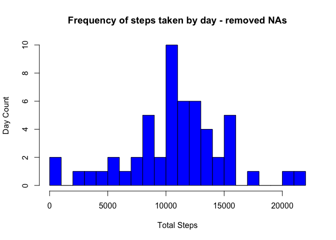
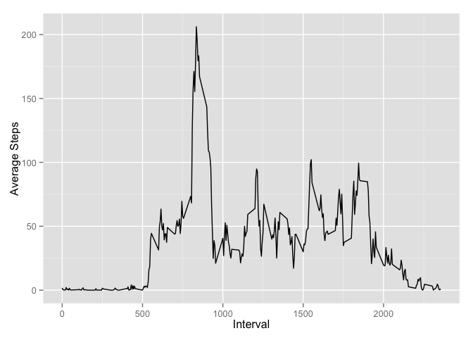
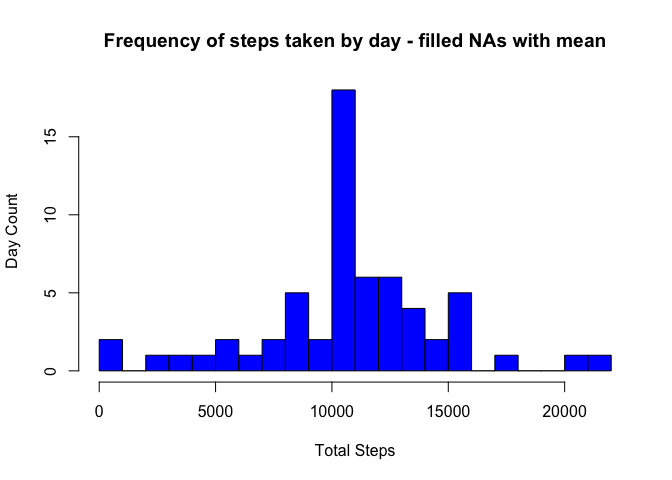
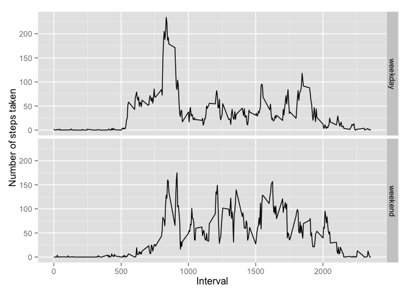

# Reproducible Research: Peer Assessment 1
## Loading and preprocessing the data

```r
  source_data <- "https://d396qusza40orc.cloudfront.net/repdata%2Fdata%2Factivity.zip"
  download.file(source_data, "activity.zip",method="curl",quiet=TRUE)  # download the file to the working directory
  activity_data <- read.csv(unz("activity.zip","activity.csv"))
```

## What is mean total number of steps taken per day?
### Preprocess the data to remove missing values and aggregate sum by date

```r
# remove observations with missing values
activity_agg_sum <- activity_data[complete.cases(activity_data),]  
# aggregate by date, sum the steps taken per day
activity_agg_sum <- aggregate(activity_agg_sum[,"steps"],by=list(Day=activity_agg_sum$date),sum) 
# provide meaningful name for the aggregated variable
names(activity_agg_sum)[2] <- "Steps"  
```
###  Generate a histogram of daily steps taken 

```r
# create histogram
hist(activity_agg_sum$Steps,freq=TRUE,col="Blue",main="Frequency of steps taken by day - removed NAs",xlab="Total Steps",ylab= "Day Count",breaks=16)  
```

 

### Compute the mean steps taken

```r
mean(activity_agg_sum[,"Steps"])  # calc the average steps taken daily
```

```
## [1] 10766
```
### Compute the median steps taken

```r
median(activity_agg_sum[,"Steps"])  # calc the median number of steps taken daily
```

```
## [1] 10765
```

```r
rm(activity_agg_sum)  # cleanup 
```


## What is the average daily activity pattern?

### Time Series: Average number of steps taken per day by time interval (time interval = 5 minutes)

```r
library("ggplot2")
# remove observations with missing values
activity_agg_int <- activity_data[complete.cases(activity_data),] 
# aggregate by interval, mean steps per day
activity_agg_int <- aggregate(activity_agg_int[,"steps"],by=list(Interval=activity_agg_int$interval),mean) 
# provide meaningful name for the aggregated variable 
names(activity_agg_int )[2] <- "Steps"  
ggplot(data=activity_agg_int,aes(Interval, Steps)) + geom_line() + ylab("Average Steps")
```

 

### Determine which interval has the most steps taken on average
**Conclusion: The most steps are taken during interval 835**

```r
head(activity_agg_int[order(-activity_agg_int$Steps),],n=5)  # order descending by average steps 
```

```
##     Interval Steps
## 104      835 206.2
## 105      840 195.9
## 107      850 183.4
## 106      845 179.6
## 103      830 177.3
```

```r
rm(activity_agg_int)  # cleanup
```

## Imputing missing values
### Calculate the number of rows in the activity data that have missing values

```r
nrow(activity_data[!complete.cases(activity_data),])  # count the rows that have missing values
```

```
## [1] 2304
```
### Missing values will be replaced with the mean value for the time interval across all days

```r
interval_means <- activity_data[complete.cases(activity_data),]  # subset only complete cases
# aggregate by interval, mean steps per day
interval_means <- aggregate(interval_means[,"steps"],by=list(Interval=interval_means$interval),mean) 
# provide meaningful name for the aggregated variable
names(interval_means)[2] <- "Mean" 
# round the mean steps 
interval_means[,"Mean"] <- round(interval_means[,"Mean"]) 
```

### Create a new data frame - merge the mean number of steps by interval with the raw data and replace missing values with the mean

```r
#merge means with raw data
activity_filled <- merge(activity_data,interval_means,by.x="interval",by.y="Interval") 
# set the missing values to the mean for the interval
activity_filled[is.na(activity_filled$steps),"steps"] <- activity_filled[is.na(activity_filled$steps),"Mean"]  
```

###  Generate a histogram of daily steps taken 

```r
# aggregate by date, sum the steps taken per day
activity_filled <- aggregate(activity_filled[,"steps"],by=list(Day=activity_filled$date),sum) 
# provide meaningful name for the aggregated variable
names(activity_filled)[2] <- "Steps"  
# create histogram
hist(activity_filled$Steps,freq=TRUE,col="Blue",main="Frequency of steps taken by day - filled NAs with mean",xlab="Total Steps",ylab= "Day Count",breaks=16)  
```

 

### Compute the mean steps taken

```r
mean(activity_filled[,"Steps"])  # calc the average steps taken daily
```

```
## [1] 10766
```
### Compute the median steps taken

```r
median(activity_filled[,"Steps"])  # calc the median number of steps taken daily
```

```
## [1] 10762
```

```r
rm(activity_filled)  # cleanup 
```
### Comparing removed NAs against imputed NAs
Conclusion is that imputing NAs with the mean interval steps across all days has little effect on changing the frequency of steps taken daily by interval. This is most likely due to large number of observations with zero steps taken during each interval.
  
  * Mean comparison:
      + Removed NAs:  10,766 steps daily
      + Imputed NAs:  10,766 steps taken
  
  * Median comparison:
      + Removed NAs:  10,765 steps daily
      + Imputed NAs:  10,762 steps daily
  

## Are there differences in activity patterns between weekdays and weekends?
### Preprocess the raw activity data

```r
# remove observations with missing values
activity_data <- activity_data[complete.cases(activity_data),]  
# convert the date variable to a Date type
activity_data[,"date"] <- as.Date(activity_data[,"date"])
# create new factor variable that denotes weekday vs weekend for the date (DayType)
activity_data$DayType <- ifelse(weekdays(activity_data$date) %in% c("Saturday","Sunday"),"weekend","weekday")
```

### Plot the data, comparing weekdays to weekends

```r
# aggregate activity (steps) by DayType and interval
activity_agg_daytype <- aggregate(activity_data[,"steps"],by=list(DayType=activity_data$DayType,Interval=activity_data$interval),mean) 
names(activity_agg_daytype)[3] <- "Steps"
###  Compare weekday with weekend activity 
p <- qplot(Interval,Steps,data = activity_agg_daytype,facets=DayType~.,ylab="Number of steps taken",xlab="Interval",geom=c("line"),method="lm")   
print(p)
```

 

```r
dev.off()  # close device
```

```
## null device 
##           1
```
### Conclusion
Observed differences in activity patterns comparing weekdays to weekends:

  * Weekday activity skews more towards the morning hours than weekends, particulary between 8-9am. Most likely this is due to the study participants preparing themselves and family (work,kids,school), if applicable, for the day.
  * Weekday activity begins earlier in the day between 5am-6am than weekends.  This is probably explained by the study participants rising sleeping later on weekends since they don't have to be at work, school, etc.
  * Weekday activity is generally lower between 10am and midnight than weekends. Possibly due to a the study participants having sendentary type jobs. Weekends probably see people out and about,running errands, recreating, etc.


```r
#cleanup
rm(activity_agg_daytype)
rm(activity_data)
```
